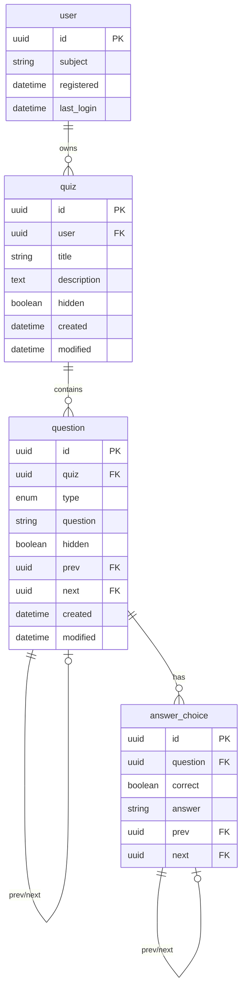

```mermaid
erDiagram
    user {
        uuid id PK
        string subject
        datetime registered
        datetime last_login
    }
    quiz {
        uuid id PK
        uuid user FK
        string title
        text description
        boolean hidden
        datetime created
        datetime modified
    }
    question {
        uuid id PK
        uuid quiz FK
        enum type
        string question
        boolean hidden
        uuid prev FK
        uuid next FK
        datetime created
        datetime modified
    }
    answer_choice {
        uuid id PK
        uuid question FK
        boolean correct
        string answer
        uuid prev FK
        uuid next FK
    }

    user ||--o{ quiz : "owns"
    quiz ||--o{ question : "contains"
    question ||--o{ answer_choice : "has"
    question ||--o| question : "prev/next"
    answer_choice ||--o| answer_choice : "prev/next"
```
