# Account Management and Login Flow

Benjrm uses your organization's identity provider (IdP) for authentication instead of maintaining its own user accounts. As a result, the organization is fully responsible for creating, updating, and disabling user accounts.

Because authentication is handled exclusively through the IdP, it is not possible to register directly in Benjrm. Before you can access the application, your organization must provision an account for you in its identity provider.

## Sign in/out through SSO

To sign in, click "Sign In" in the top-right corner of the application. You will be redirected to your organization's identity provider, where you can authenticate using your organization's login credentials. Depending on your organization's login procedure, your login experience may vary, but should be familiar to you.

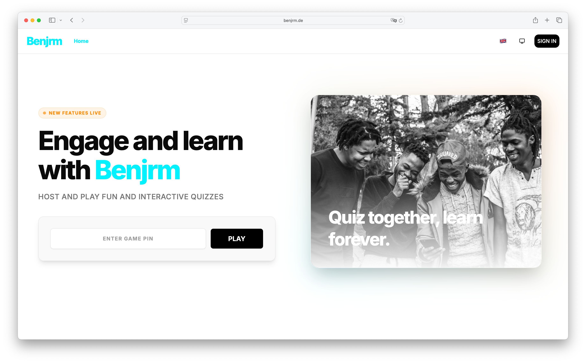

After a successful login, you will be redirected back to the application and signed in automatically. The application will remember your login session until you sign out or your session expires. This typically happens after the browser is closed, closing the tab doesn't sign you out.

To sign out, click "Sign Out" in the top-right corner of the application. You will be signed out of the application.

## Account provisioning

Clicking the user icon in the top-right corner opens a profile popup that provides account-related information and sensitive account actions. This menu is designed to give users visibility into how their account is managed, while also offering controlled access to account deletion.

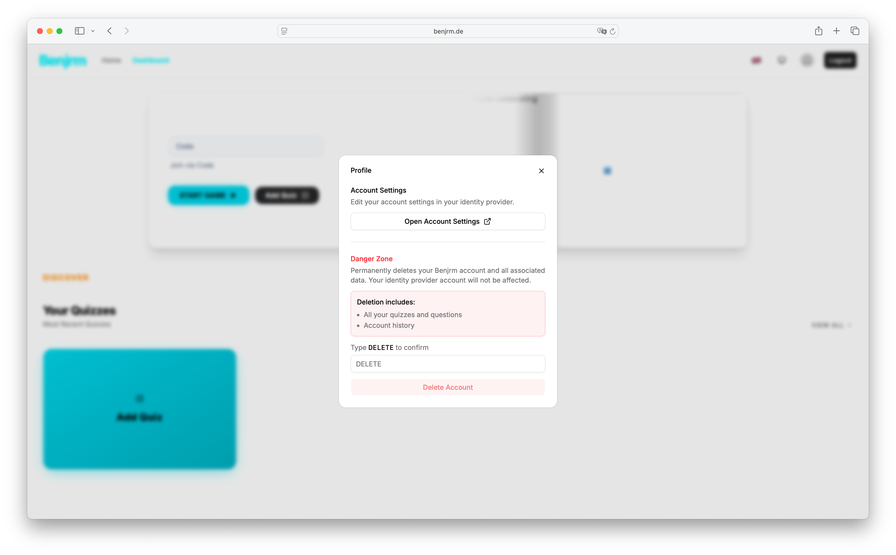

Some options in the profile popup may be disabled or hidden based on your organization's configuration. For example, if your organization has disabled the ability for users to change their username or password, those options will not be available in the profile popup. For more details contact your organization's system administrator.

### Profile information

Any changes to your profile, authentication methods, or security settings must be performed in the IdP rather than in Benjrm. Depending on how your organization has configured access, this may include updating personal details such as your name or email, managing password or sign-in methods.

Benjrm itself does not store or control these settings. Instead, it relies entirely on the IdP for user identity and access management. Because of this, updates made in the identity provider are automatically reflected in Benjrm the next time you sign in.

If certain settings are not accessible to you, or if you need assistance with account changes, you will need to contact your organization's administrator, as they are responsible for managing identity provider configurations and permissions.

### Account deletion

Account deletion permanently removes your Benjrm account and all data associated with it from the application. This action is intended for users who no longer require access to Benjrm and want to erase their Benjrm-specific data.

When you delete your account, all data stored within Benjrm that is tied to your user profile is permanently removed. This includes your created quizzes, questions, and any related content. Once the deletion process is completed, this data cannot be recovered.

It is important to understand that deleting your Benjrm account does not affect your IdP account. Your organizational login remains active and is managed independently by your organization. You will still be able to use your identity provider credentials for other services. After reset, if you wish to regain access to Benjrm, just login again with your IdP credentials, and a new clean Benjrm account will be created for you.

To prevent accidental deletion, the process requires explicit confirmation. You must type "DELETE" exactly as shown before the action can proceed. This ensures that account removal is intentional, as the operation is irreversible once confirmed.

Upon successful deletion, you will be signed out of Benjrm and shown a popup confirming your action. This also gives you a brief summary of the consequences and a reminder that your IdP account remains unaffected. If you have any questions or concerns about the deletion process, please contact your organization's administrator for assistance.

# Frontpage

The Frontpage is the main entry point of Benjrm for all users. It is designed primarily for participants who want to join an active quiz session quickly and without additional navigation. At the center of the screen, is an input field for entering a game PIN. This PIN is provided by the host of the game, such as a teacher or quiz organizer, and uniquely identifies an active session.

After entering a valid PIN, users are connected to the corresponding game lobby.

## Change Language

The application supports multiple languages, which can be changed directly from the navigation bar at the top of the screen on the right side. The language selector allows you to switch the interface language at any time.

Currently supported languages are:
- German (de)
- English (en)

Once a language is selected, the change is applied immediately across the entire application. All menus, labels, and messages are updated without requiring a page reload.

>  **Note:** Quiz content is user-generated content and is not automatically translated by the platform. This means that if a quiz is created in a specific language, it will be displayed in that language even if the application language is set to another language.

## Change the Color Theme

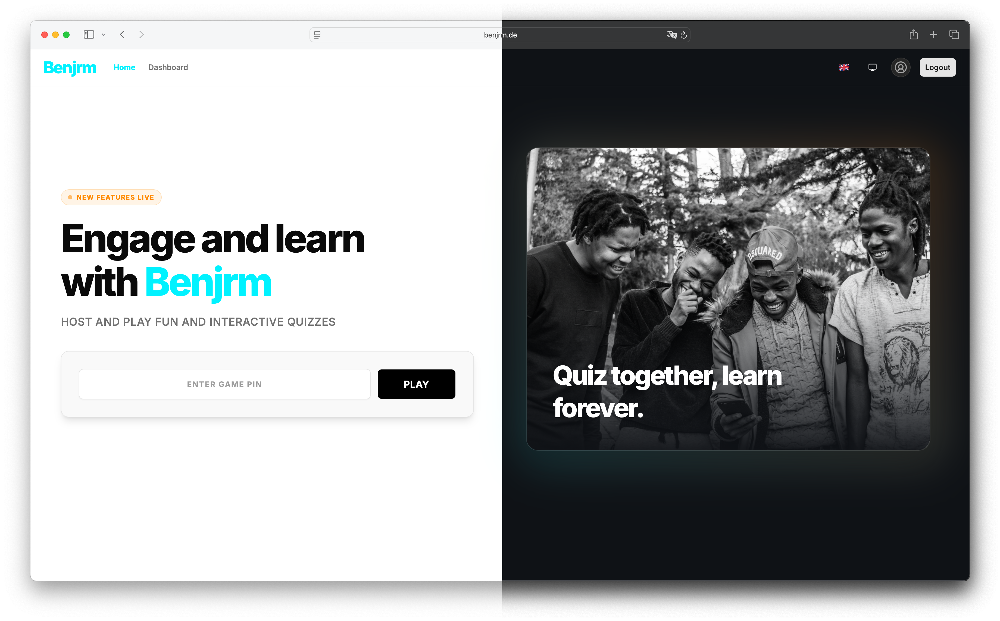

Benjrm provides a theme toggle that allows you to switch between available visual themes, such as light mode, dark mode, and auto mode. The toggle can also be found in the navigation bar next to the language selector.

Auto mode follows the theme preference of your browser or operating system and automatically adapts the application accordingly. When your system theme changes, Benjrm will also update in real time to match the new setting. The selected theme is applied immediately and affects the entire application interface. Your preference is stored locally so that it is preserved across sessions on the same device and browser. Auto mode is the default value.

## Dashboard

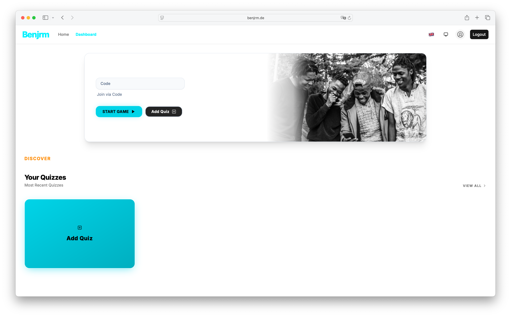

The Dashboard is the main entry point for the quiz organizer. It acts as a central hub where you can create, manage, and play quizzes, as well as access general application settings. From here, you can navigate to all core features without needing to leave the page.

## Join a Quiz

At the top of the Dashboard, there is a dedicated input field for joining existing quiz sessions using a game PIN. This PIN is provided by the quiz host and uniquely identifies a running game session.

After entering a valid PIN and confirming, you are redirected to the waiting lobby of that session. In the lobby, you can set up your player profile and wait until the host starts the game. If the PIN is invalid or the session cannot be found, an error message will be displayed.

## Quiz List

The main section of the Dashboard contains the list of available quizzes. This includes both quizzes you have created and quizzes that are available to you based on your account context.

Each quiz entry provides quick actions. You can open a quiz to edit its content, modify its structure, or adjust settings. You can also start a quiz directly from the list to launch a live game session.

Quizzes are typically grouped into sections such as recent quizzes and your own quizzes to make navigation easier and faster.

# Question Types and Points

Benjrm supports four different question types, each designed for a specific use cases. But all of them have in common that Markdown [^1] is supported (at least in their question head).

Points are gained not only based on the correctness of an answer, but also on how quickly it was submitted. Faster answers receive more points than slower ones. This scoring mechanism applies to all scorable question types.

## Multiple Choice

Multiple Choice questions allow participants to select one or more answers from a set of options. This type is used when a question has several correct answers. A response is considered fully correct only if all correct options are selected and no incorrect options are chosen.

If a participant selects only some of the correct answers or also includes incorrect ones, the response is treated as partially correct. In this case, the player will still receive points, but fewer than for a fully correct answer. The final score is based on how closely the submitted answer matches the complete correct set.

*Example:* What days start with "S"?

If a player selects...
- Monday and Tuesday, no points are gained.
- Monday, Tuesday and Sunday, no points are gained due to the fact that there are more or equal wrong answers than correct answers.
- only Sunday, partial points are gained.
- Saturday and Sunday, full points are gained.
- Monday, Saturday and Sunday, partial points are gained.

## Single Choice

Single Choice questions allow participants to select exactly one answer from a list of options. This type can be used when only one valid option exists, but also in cases where multiple answers could be correct and the participant is expected to choose just one.

Once submitted, the answer is evaluated against the predefined correct option. If the selected answer is correct, the player receives points. If a wrong answer is selected, no points are awarded.

*Example (one correct)*: What color is the sky? (Blue / Green / Red)
- If a player selects Blue, they receive full points.
- Any other selection results in no points.

Playing a quiz from a remote location can sometimes affect how a question is interpreted. Depending on the player's local time or environment, the same question may feel slightly different in meaning. For example, for some players it might be sunrise or sunset at the time of answering, meaning the sky is not necessarily blue, but instead appears orange or red. Here is the same question but with two correct answers.

*Example (two correct)*: What color is the sky? (Blue / Green / Orange / Pink)
- If a player selects Blue or Orange, they receive full points.
- Any other selection results in no points.

## Order

Order questions require participants to arrange items in the correct sequence. Instead of selecting predefined answers, users must drag and reorder elements into the correct order. This type is ideal for processes, timelines, or step-based logic.

For example, assume a question has the correct order 1, 2, 3, 4:
- If a user submits 3, 4, 1, 2, they will still receive partial points because some relationships between items are correctly matched.
- A completely reversed order such as 4, 3, 2, 1 will result in no Points.
- While the fully correct sequence 1, 2, 3, 4 yields the maximum score.

## Slide

Slides are non-interactive content elements used to present information within a quiz. Unlike question types, slides do not require any response from participants and are not evaluated or scored. When a slide is shown, participants simply view the content and proceed when the quiz continues, without any interaction or input required.

Slides can be used to introduce a new section, explain rules, provide background information, or display additional learning material related to upcoming questions. They help guide participants through the quiz.

For simplicity, slides will be treated as questions in the following sections unless explicitly stated otherwise.

# Quiz Management

Quizzes in Benjrm are interactive learning units that can be created, edited, and played in real time. They are designed to support different question types. Each quiz can contain a combination of multiple different questions.

## Create a new quiz

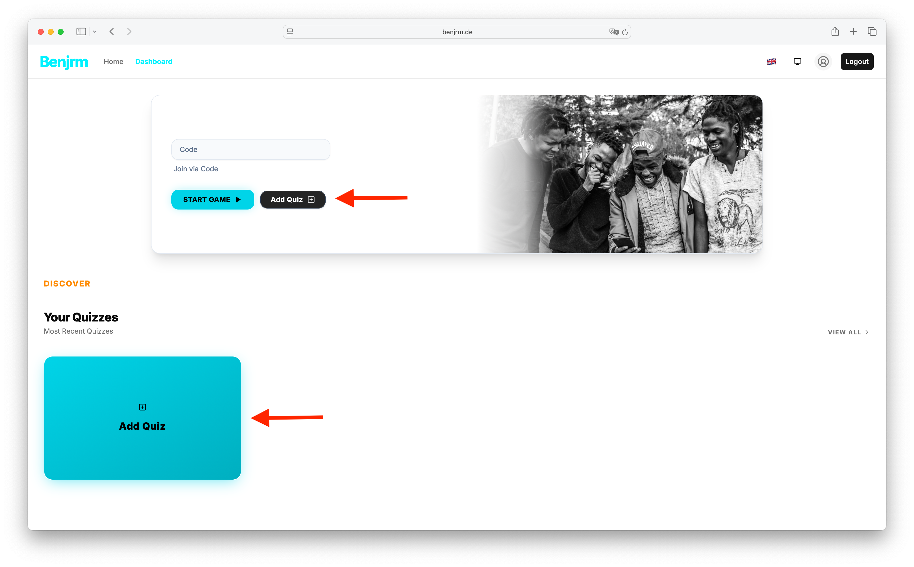

You can create a new quiz from the Dashboard by selecting "Add Quiz".

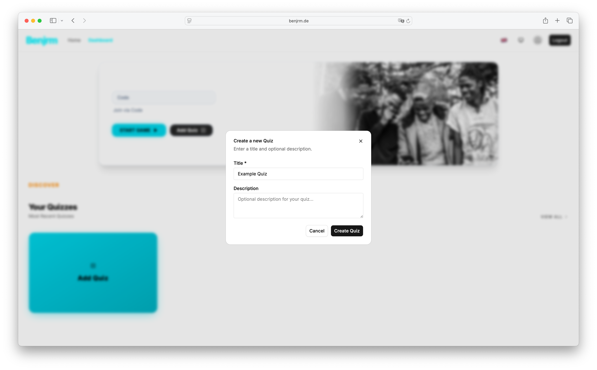

After that, a popup will appear where you're asked to enter a name and an optional description for the quiz. Both the title and description can be changed later at any time.

## Questions

Questions are a crucial part of a quiz. They define the core interaction between the quiz creator and the participants and determine what knowledge, skills, or reasoning is being tested.

A more detailed overview of the supported question types can be found in the question types section.

### Create a question

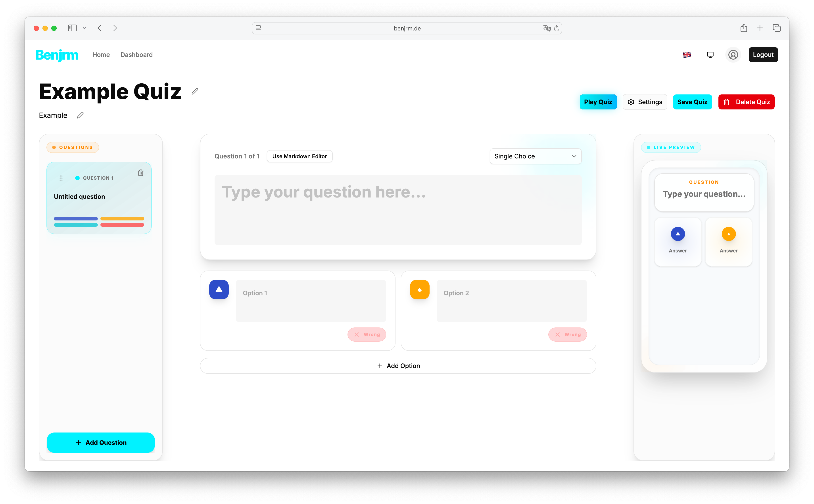

Inside the quiz editor, you can add various questions on your own. A new quiz always has one unsaved question in it. To add more questions, click on the bottom left button "+ Add Question" (only if the current question is valid; see more in the validator section below).

### Rearrange questions

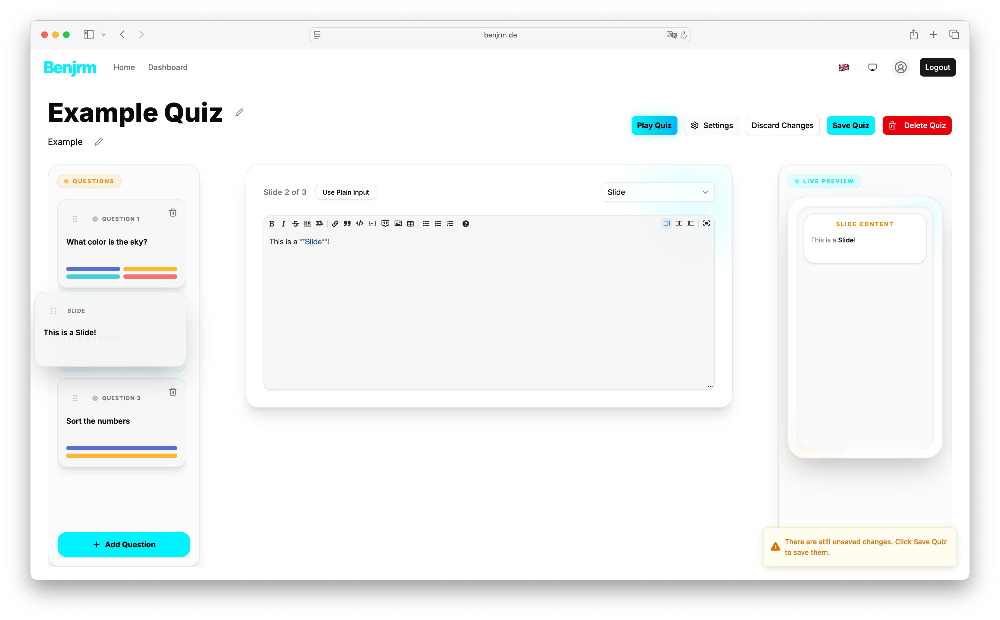

To reorder questions, simply drag them within the left-hand list by holding the handle in the top-left corner of each question. Questions can be moved vertically to adjust their position in the quiz. The order shown in this list always reflects the actual order in which questions will appear during the quiz.

### Delete a question

To delete a question, simply click the trash can icon in the top right corner of the desired question. The question should immediately disappear.

### Selecting a Question for Editing

To select another question for editing, you can either create a new question or choose an existing one from the list of questions. Clicking on a question in the left-hand list will open it in the editor, allowing you to view and modify its content, settings, and answers.

### Question validation

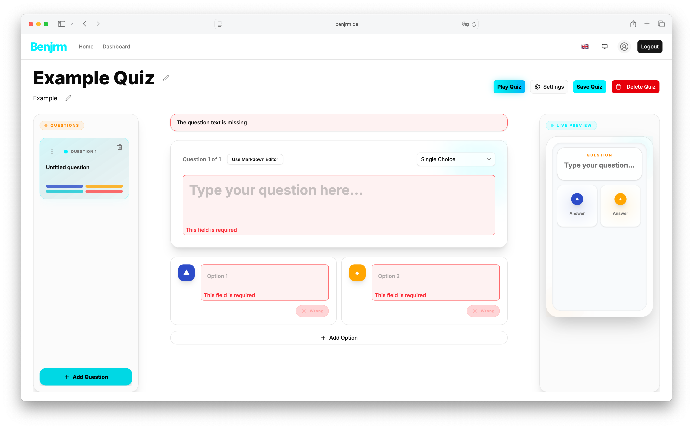

Questions follow some validation rules. If a question is edited and does not fulfill the requirements, the quiz can't be saved and also the current question can't be left. The not matching fields get marked and also errors popup to tell you what is missing. You can either fix them, or just delete the problematic question. 

### Question type

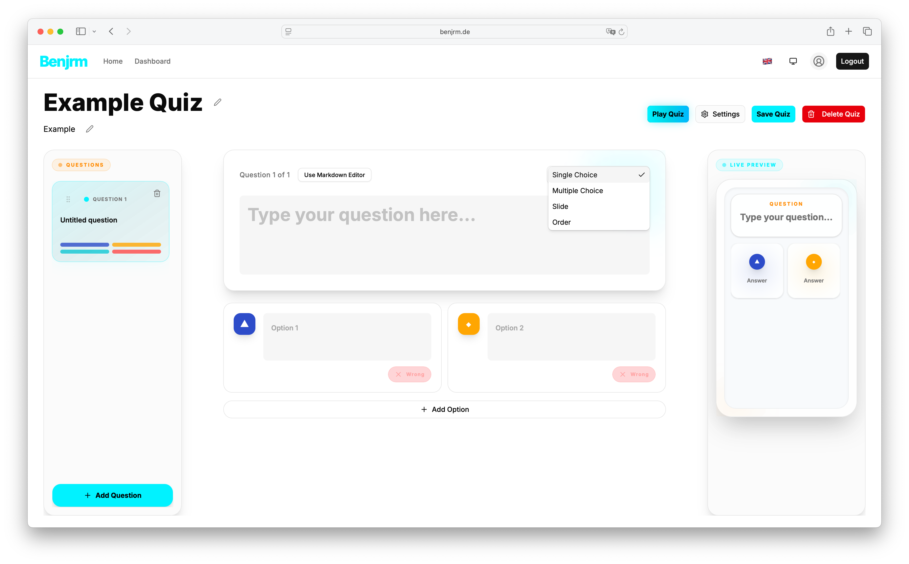

To select a different question type, simply click the dropdown located above the question body text field.

Some question types can be converted into other types without losing all existing data. This means that switching types does not necessarily reset the entire question. For example, a Single Choice question can easily be converted into a Multiple Choice question, since both share a similar structure of selectable options.

### Markdown and HTML

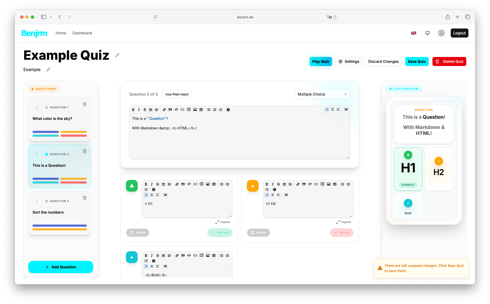

All text fields of a question support Markdown as a markup language for applying basic formatting such as styling text, creating lists, or inserting tables.

Because Markdown is closely related to HTML, limited HTML support is also available. However, this support is intentionally restricted for security reasons. Certain HTML elements and attributes are disabled to prevent unsafe behavior. For example, event handlers such as `onclick` are not allowed.

To make content editing easier, a built-in Markdown editor [^2] is available. This editor provides a more user-friendly way to write and preview formatted content.

To enable the Markdown editor, click the "Use Markdown Editor" button located above the text input field. This switches the interface into Markdown editing mode. Once enabled, all relevant text fields are equipped with the Markdown editor, allowing you to format content more easily and work with a richer editing experience across the quiz. To switch back, click "Use Plain Input", which is located in the same place where the "Use Markdown Editor" button was previously shown. This will disable the Markdown editor and return all fields to the standard plain text input mode.

## Edit quiz metadata

By clicking the pencil icon next to the quiz name or description, a popup will appear where you can edit both fields.

## Save and revert changes

Changes in the quiz editor are not automatically applied. To persist any modifications, you must explicitly click the "Save Quiz" button in the header. This ensures that updates to questions are only stored when you are ready.

There is no dedicated undo (last step) button in the editor. Once changes are saved, they overwrite the previous version of the quiz. Because of this, it is important to review your edits carefully before saving. If you want to discard all changes made during the current editing session, you can use the "Discard Changes" option. This will revert the quiz back to the last saved state, effectively undoing all unsaved modifications (This can't be undone).

Changes are stored in your browser until applied, which means that reloading the page, closing the tab, or returning later on the same device and browser will usually restore your current state automatically. However, this data is stored locally and does not normally sync across different browsers or devices. As a result, changes made in one browser will not appear in another. It is also important to be aware that browser storage is not guaranteed to be truly permanent. If you wait too long (days, months or even years depending on the browser) before returning, or if your device runs low on storage, the browser or operating system may clear stored data as part of automatic cleanup processes. In such cases, locally stored changes may be lost.

# Playing with Benjrm

Players (also called "Participants") are the main audience of Benjrm. For them, no login is required to participate in a quiz. In fact, it does not matter whether a player has an account or not.

## Hosting a Session

To start a quiz, it can either be launched directly from the Dashboard using the "Play Quiz" button, or started from within the Quiz Editor using the "Play Quiz" button located next to the "Save Quiz" button.

Both options create a live game session from the selected quiz and prepare it for participants to join using a game PIN.

## Joining a Quiz

Playing quizzes in Benjrm is designed to be simple and accessible for everyone. Participants can join a game session instantly using a game PIN provided by the host, without needing to sign in or create an account. This makes it easy to involve large groups of users quickly, such as in classrooms or live events.

Once joined, players are placed into a live session where they answer questions in real time. The experience is fully focused on interaction and participation, while all game control remains with the host who manages the flow of the quiz.

## Waiting Lobby

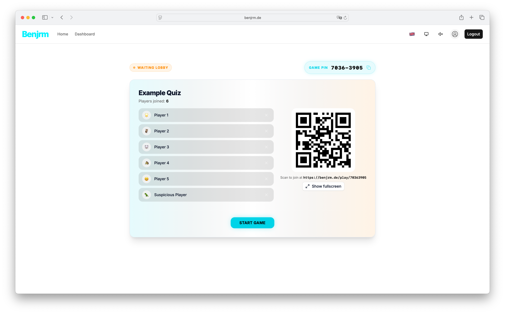

The waiting lobby displays a list of all joined players. During the waiting phase, users can get kicked from the host by clicking the "x" right next to the name of the unwanted player. This option is not present on the players view.

> **Note:** Players aren't banned, currently nothing prevents them from joining again.

To quickly join a game session, the displayed QR code can be used. It can be scanned with a smartphone camera or any QR code scanning app, which will automatically open the corresponding game session on the device. This provides a fast and convenient way for participants to join without manually entering the game PIN.

When all players have joined the session, the quiz can be started by clicking "Start Game". After the game is started, the first question will be displayed to all participants. New players can't join then anymore, existing players can reconnect from the same browser tab (opening a new browser tab and joining from it will not work anymore). From this point on, the quiz progresses in real time, with the host controlling the flow between questions.

> **Hint:** While the waiting lobby is open and during the quiz, background music is played for the host by default. To mute or unmute the music, click the speaker icon in the navigation bar, located next to the theme toggle. The selected mute state is applied immediately.

## The Game Flow

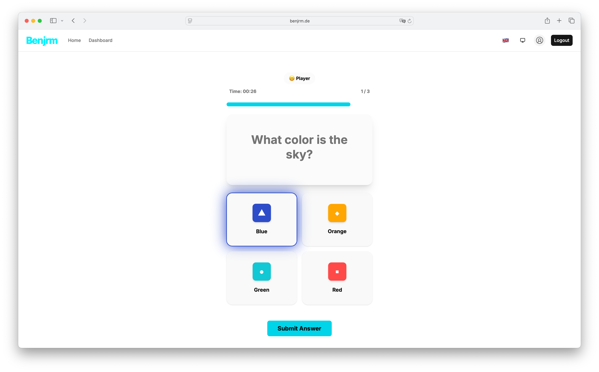

Each question is displayed on the player's device with its corresponding input method, depending on the question type. Players respond individually on their own devices by selecting answers, arranging items, or entering their response within the given time limit.

The interface is designed to be intuitive enough that no additional explanation is required for how to interact with it. All available actions are clearly presented in the UI and should be self-explanatory for participants. Depending on the complexity of the question and the screen size of the device, it may be necessary to scroll down to view the full content of the question.

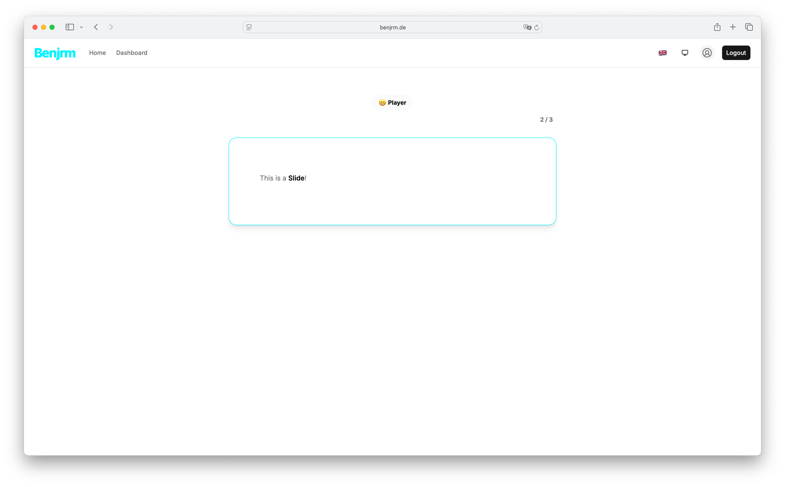

However, one important interaction requirement applies to all question types (besides slide): each answer must be explicitly submitted by clicking "Submit Answer". Answers are not automatically sent when a selection is made. This ensures that players have full control over when their response is finalized.

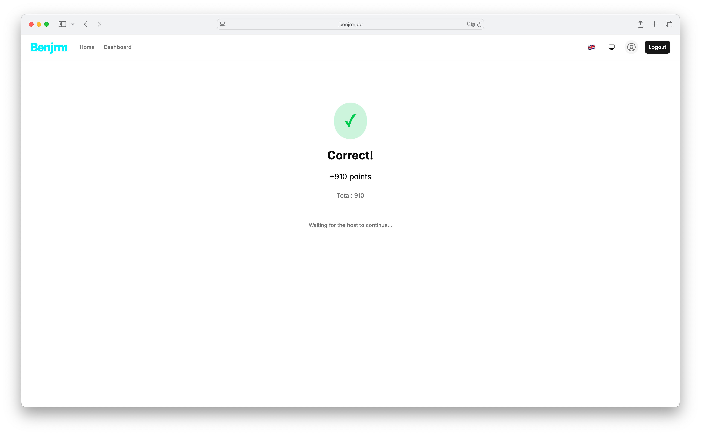

After submitting an answer, players must wait until either all participants have submitted their responses or the host progresses the quiz. Once the round is completed, players receive feedback indicating whether their answer was correct and how many points they have gained for that question.

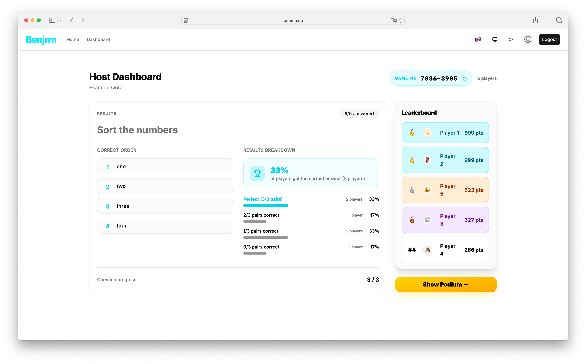

## Final Podium

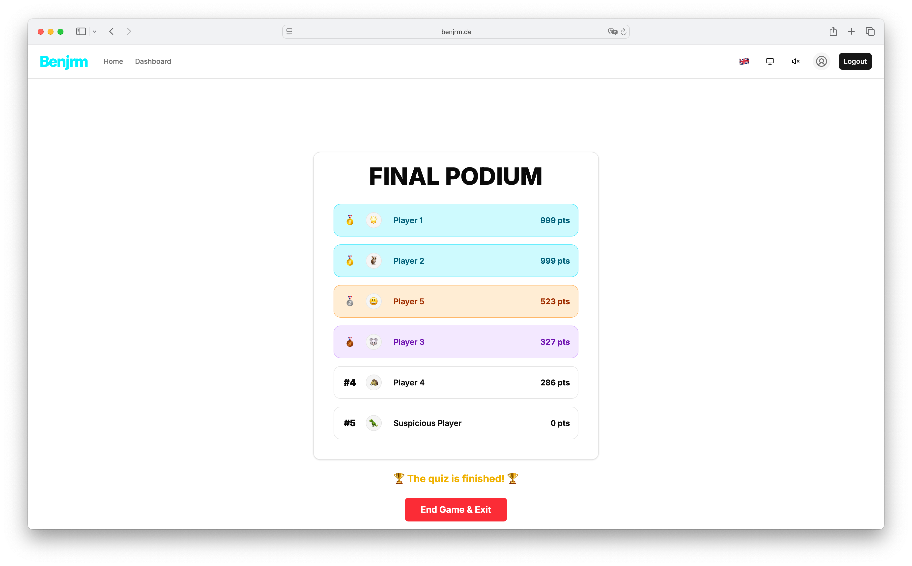

Once all questions have been completed, the quiz ends with the final podium. This screen presents the final ranking of all participants based on the total number of points they have accumulated throughout the quiz. The top three positions are highlighted on the podium, celebrating the first, second, and third places. Players with the same points will share a position and may get the same highlighting on the podium. All other remaining participants are shown in the final leaderboard below, together with their total score.

[^1]: https://en.wikipedia.org/wiki/Markdown
[^2]: https://remarkjs.github.io/react-markdown/

